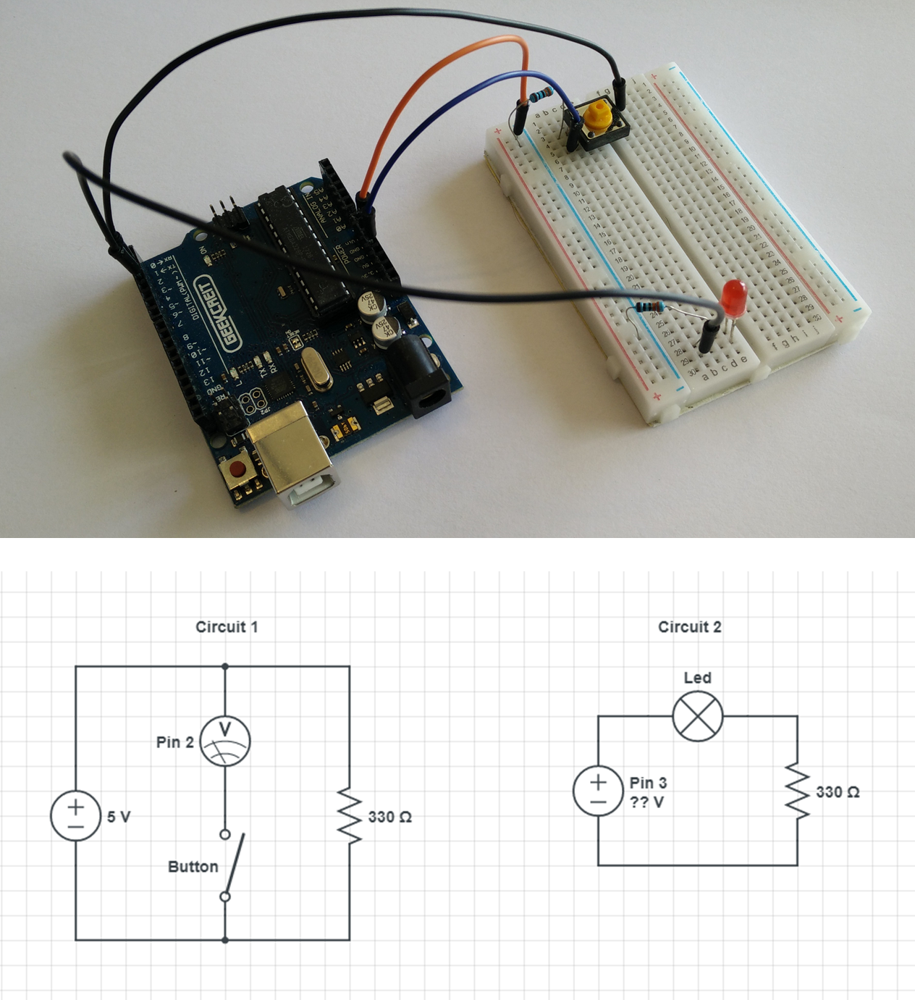
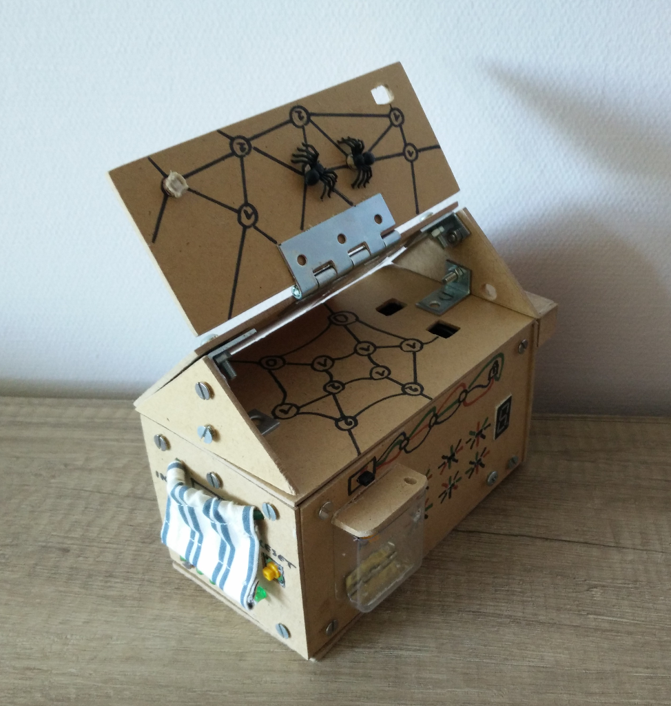
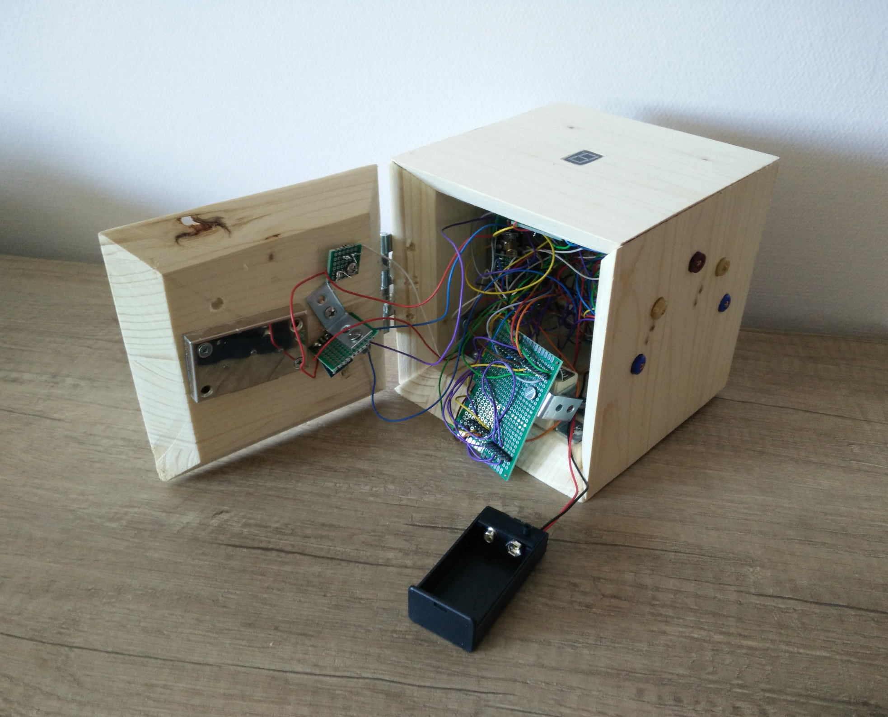

```{r setup, include=FALSE}
knitr::opts_chunk$set(echo = TRUE)
```

In 2018, I received my first Arduino, i.e. a small programmable electronics board (see image below).

<br>
<center>

</center>
<br>

By connecting hardware components and programming the Arduino CPU a wide range of devices can be build.

### Controlling a led

As a simple example, in the setup below a led light can be turned on or off by pressing a button.

<br>
<center>

</center>
<br>

Circuit 1 detects when the button is pressed by measuring the current in Arduino's second input pin. The signal measured in pin 2 is further refined to detect individual clicks. With each click the voltage output of pin 3 alternates between 0V (led is off) and 5V (led is on). The following script programs this behaviour in Arduino.

```{c, eval = FALSE}
const int button_pin = 2;
const int led_pin = 3;

bool button_active = false;
bool led_active = false;

void setup() { // runs on startup
  pinMode(button_pin, INPUT);
  pinMode(led_pin, OUTPUT);
}

bool button_press() {
  int button_status = digitalRead(button_pin);

  if(button_status == HIGH) { // button is down
    if(button_active) {
      return(false); // We have already registered this click
    }
    button_active = true;
    return(true);
  } else {
    // The button is no longer pressed,
    // ready to register the next click
    button_active = false; 
    return(false);
  }
}

void loop() { 
  delay(5); // Run every 5 milliseconds

  if(button_press()) {
    led_active = !led_active; // switch led active
    if(led_active){
      digitalWrite(led_pin, HIGH); // led is on
    } else {
      digitalWrite(led_pin, LOW); // led is off
    }
  }

}
```

### Arduino puzzle box

As a huge fan of puzzles and riddles, I designed a hand crafted and Arduino controlled puzzle box (image below). The box combines a wide range of sensors and can only be opened after solving seven original puzzles. 

<br>
<center>

</center>
<br>

Most of the puzzles combine logical deduction with a unique input method. For example, as part of a puzzle, the box sends a signal in Morse code. This puzzle is solved when the participant uses a flashlight to signal the correct answer in Morse back to the box.

### Detecting Morse signals

The puzzle box contains a photoresistor, which has a lower resistance when it is lighter. By measuring the amount of current passing through this resistor, we can measure the amount of light. 

Sensor data is always noisy and therefore interpreting the raw signal requires careful planning. The image below shows the steps for converting the raw output from the photoresistor into an interpretable value. 

<br>
<center>

</center>
<br>

We carefully calibrate two threshold for the light intensity. When the intensity exceeds the upper threshold, the flashlight is on, and when intensity drops below the lower threshold, the flashlight is off. In between both thresholds the flashlight can be either on or off depending on the last recorded situation. The difference between both thresholds prevents status changes resulting from noisy sensor output. The resulting on/off pattern is carefully timed and further processed into an interpretable value.

### Future projects

Currently, I'm working on a second version of the puzzle box with a few modifications in puzzle design and lasercutted surfaces for a better puzzle experience. I have also started designing a second puzzle box.

<br>
<center>

</center>
<br>


