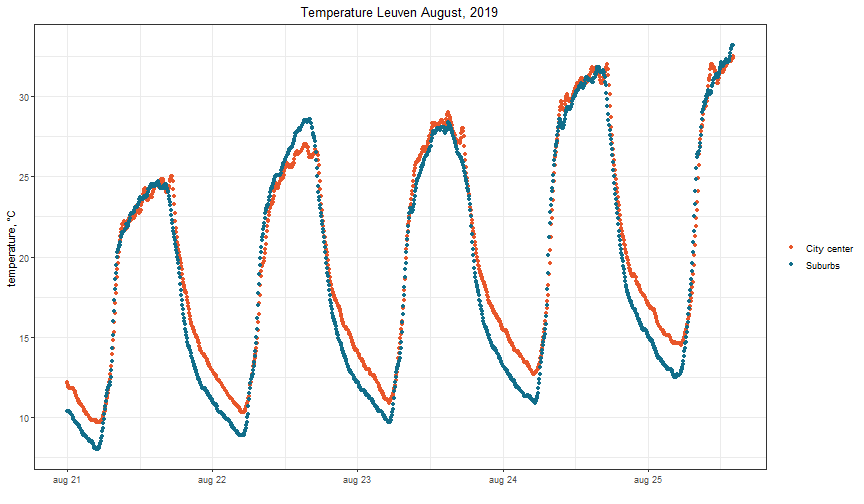
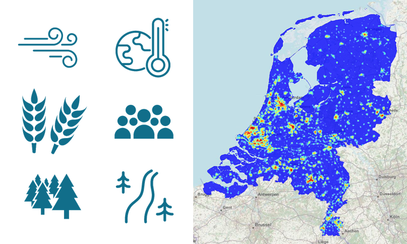
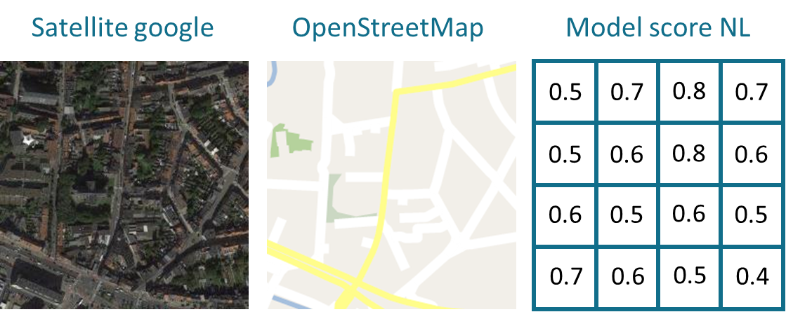
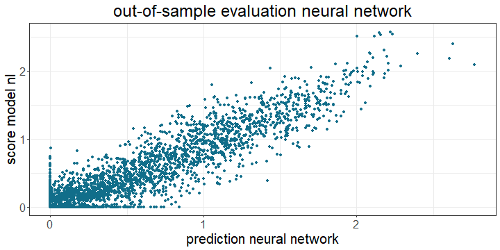
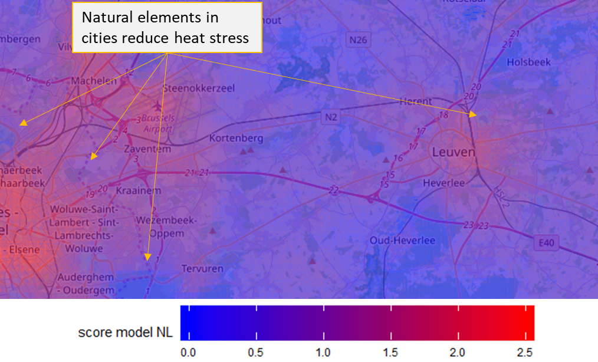
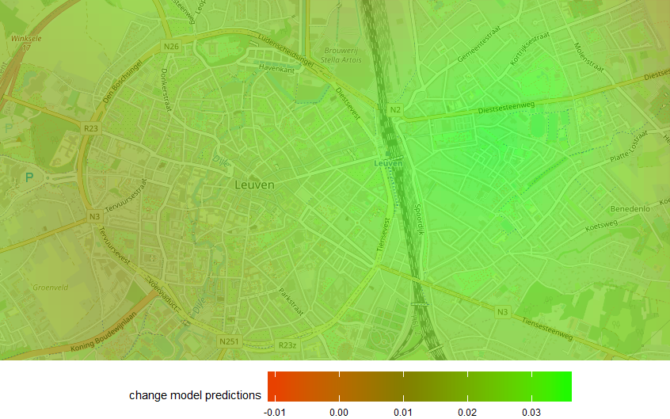

```{r setup, include=FALSE}
knitr::opts_chunk$set(echo = TRUE)
```

Together with 4 other PhDs at the faculty of economics, I participated in the 2020 edition of the KU Leuven Datathon competition.

### Setting

This edition of the Datathon collaborated with citizen science projects of the city of Leuven. All participants received sensor data at 5 minute intervals from 76 weather stations spread around Leuven. There was no predefined task, giving each groups the freedom to come up with their own application of the data.

<br>
<center>
```{r, message = FALSE, echo = FALSE, out.width='400px', out.height='300px'}
require(leaflet)
load('data/location.RData')
leaflet(data = location) %>% addTiles() %>%
  addMarkers(~LON, ~LAT)
```
</center>

### Urban heat islands

We analysed the data and noticed large temperature differences between the city center and surrounding suburbs on summer nights (see figure below). During hot summer days both the city center and suburbs warm up, but during the nights suburbs cool down more rapidly. This effect which is known as the 'urban heat island effect' results in a difference of several degrees on summer nights.

<center>

</center>

Observing this effect, we formulated two research questions for the Datathon:

1. Which areas of Leuven suffer the most from the urban heat island effect?
2. What is the effect of adding green areas (e.g. parks, green roofs, ...) on the heat stress?

### Modelling the spread of heat around Leuven

We received detailed temperature data for 73 locations around Leuven. Our main challenge was predicting the temperature at other locations based on this data. 

The breakthrough came, when we discovered a map from Rijksinstituut voor Volksgezondheid en Milieu (RIVM) that models the urban heat island effect for the Netherlands. This map (shown below) was created by combining a large nubmer of data sources including wind speed, landuse, population density, environmental elements, ....

<br>
<center>

</center>
<br>
We lack most of these required covariates for the city of Leuven, but many of these covariates can likely be inferred from satellite data (e.g. landuse, population density, ...). Therefore, we have trained a neural network to replicate the outcome of the Dutch model based on sattelite imagery and open streets map data.

We sliced the Dutch map in blocks with a width and height of 400 meters. For each of these blocks we collected satellite images from Google maps and OpenStreetMap data covering the same area. Furthermore we computed the score of the Dutch model for 16 subregions within each block (see image below):

<br>
<center>

</center>
<br>

Using this method 16822 blocks were created. 80% of these blocks were used to train a convolutional neural network. The remaining blocks were used to test the model performance. The figure below compares the predicted and actual score of the model on these test blocks. 

<br>
<center>

</center>
<br>

Satellite imagery appears to be a good substitute for the actual model covariates and we can apply our trained model to the area around Leuven. The image below predicts that Leuven (on the right) and Brussels (on the left) are affected by urban heat stress. On careful inspection, we observe a reduction in heat stress around parks. This effect is strengthened when the park contains a lake.

<br>
<center>

</center>
<br>

The scores of the Dutch model reveal which areas are likely experiencing heat stress. However, these scores are dimensionless, which makes it difficult to interpret the magnitude of the urban heat island effect. We translate these scores to degrees Celsius by calibrating the predictions from the Dutch model to the difference in night temperature recorded by the sensors around Leuven.

<center>
```{r, fig.height = 4, fig.width = 8, out.height = '300px', out.width = '600px', center = TRUE, echo = FALSE, message = FALSE, warning = FALSE}
require(tidyverse)

betas <- readRDS('data/lm_betas.rds')
smooth_fit <- loess(beta ~ as.numeric(day), data = betas, span = 0.5)
betas <- betas %>% mutate(smooth = predict(smooth_fit))

betas %>% 
  ggplot(aes(x = day, y = smooth)) + 
  geom_line(color = "#116E8A", size=2) + 
  theme_bw() +
  xlab('') +
  ylab('Temperature difference') +
  theme(text = element_text(size=14),
        plot.title = element_text(hjust = 0.5, size = 13)) +
  ggtitle('Effect of a change of one unit in model score on the temperature in Leuven at night.')
```
</center>

In the summer months an increase of one unit in the model score corresponds to an increase of one degree Celsius in the temperature at night. Temperature differences are smaller during the winter months.

### Reducing heat stress in Leuven

We investigate to what extend adding green areas (e.g. parks, green roofs, ...) can alleviate the heat stress in Leuven. For this, we add fictional parks with an area of one hectare (10 000 $m^2$) to the open street maps and Google satellite imagery. We measure the heat stress improvement of each park, by comparing the predictions of the neural network on these modified maps with the predictions on the original maps.

The map below visualizes the smoothed reduction in model score by adding a park. 
<center>

</center>
<br>
Adding a park in the area immediately behind the station in Kessel-lo has the largest effect on city heat stress. This is not surprising, since our neural network and the sensor data both identify this densely populated area as the warmest region of Leuven. If we convert these model scores to degrees Celsius, we observe that planting a park of one hectare results in a decrease of at most 0.03 degrees Celsius at night. This value is small, so although parks have many other benefits, small, isolated parks alone will not resolve the city heat stress.


