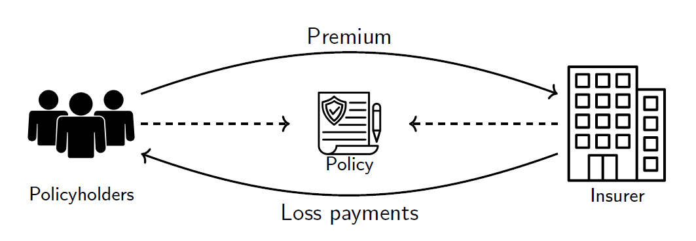
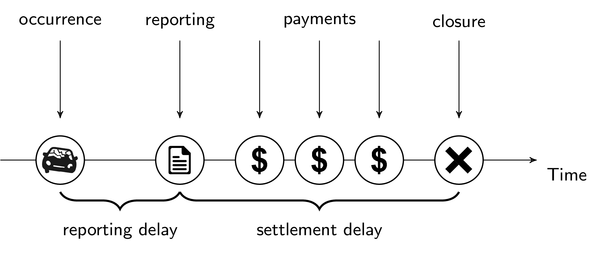
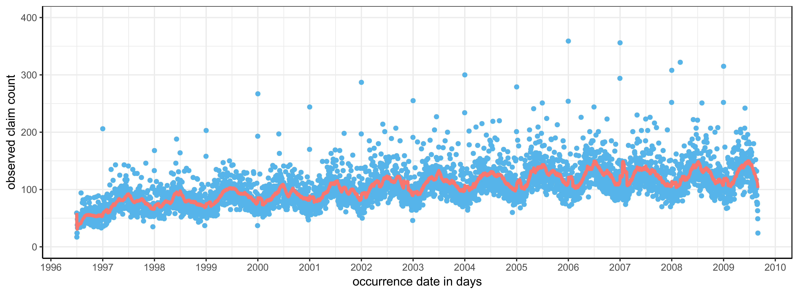
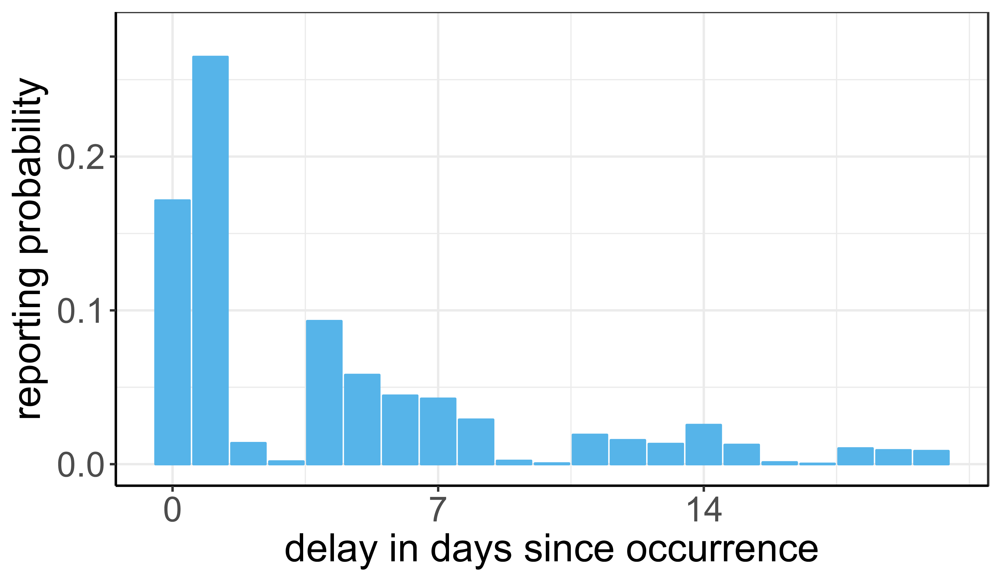
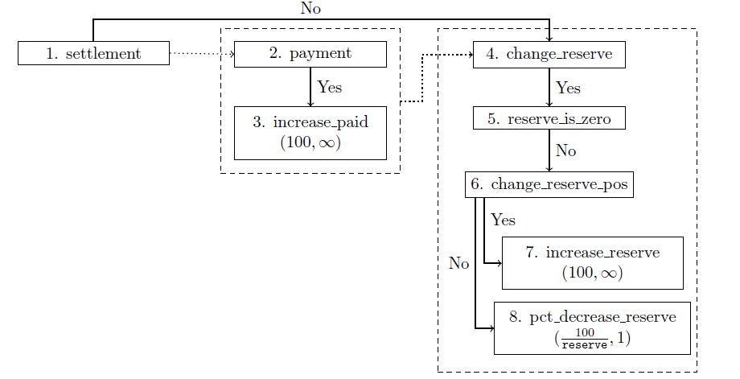

```{r setup, include=FALSE}
knitr::opts_chunk$set(echo = TRUE)
```

### Setting

Insurance is a unique industry in which the production cycle is inverted, i.e. income precedes costs. Policyholders pay a premium to the insurer, who in return guarantees to reimburse future losses resulting from insured accidents. 

As a result of the inverted production cycle, insurers set aside funds, the so-called reserve, to cover claims that have already occurred, but are not yet (fully) reimbursed. For insurance to function properly, it is essential that policyholders trust that these reserves are adequate for covering all future costs.

<center>

</center>

My PhD thesis predicts the future costs of claims that have already occurred from the insurance perspective. For this, we model the evolution of individual claims which is visualized in the timeline below. This timeline starts with the occurrence of a claim. Typically there is a delay between the occurrence and reporting of the accident, which can range from a few days to several weeks. Once the claim is notified to the insurer a stream of payments follows until the claim is finally settled.

<center>

</center>

### Project 1 & 2: Occurrence and reporting of insurance claims
My first papers models the number of claims that have already occurred, but are not yet reported. Predicting the number of missing claims is important to accurately estimate the future costs of the insurer. 

The figure below shows the daily number of claims that occurred between July, 1996 and August, 2009 and are reported before August 31, 2009. Since only claims reported before August 31, 2009 are observed, we see a decrease in observed claim counts for recent dates. In our research we adjusted this graph for unreported claims and estimated the number of unreported claims.

<br>

<center>

</center>

<br>

Hereto, we modelled the time between the occurrence and reporting of the claim. The figure below shows the empirical reporting delay distribution for claims that occurred on a Thursday. Remarkably is the large drop in the reporting probability for delays of 2 and 3 days. These delays correspond to reporting on a Saturday (Thursday + 2) or Sunday (Thursday + 3). Our research focused in particular on innovative methods for incorporating the effects of weekdays and holidays in the reporting delay distribution.

<br>

<center>

</center>

Papers on this topic:

> Jonas Crevecoeur, Katrien Antonio, and Roel Verbelen. Modeling the number of hidden events subject to observation delay. European Journal of Operational Research, 277(3):930 - 944, 2019. ISSN 0377-2217. URL https://doi.org/10.1016/j.ejor.2019.02.044.

> Roel Verbelen, Katrien Antonio, Gerda Claeskens, and Jonas Crevecoeur. Modeling the occurrence of events subject to a reporting delay via an EM algorithm. 2019. Available at arXiv: https://arxiv.org/abs/1909.08336.

### Project 3 & 4: Evolution of reported claims
Once claims are reported, it might still take several years to fully settle the claim. In special circumstances with large claims involving bodily injury and legal procedures this process can take over 10 years. To reduce the uncertainty for the insurer we develop a model for the evolution of claims. 

For this, we have developed a hierarchical model that splits the evolution of claims in small building blocks. In contrast with an end-to-end machine learning approach, which would immediately estimate the final claim cost, the building block approach allow for greater interpretability and control over the model. In particular, expert opinion can be incorporated in the analysis. 

<center>

</center>


Papers on this topic:

> Jonas Crevecoeur, Katrien Antonio. A generalized reserving model: bridging the gap between pricing and individual reserving. 2019. Available at arXiv: https://arxiv.org/abs/1910.12692.

> Jonas Crevecoeur, Katrien Antonio. An hierarchical approach for reinsurance pricing and reserving. 2020. Working paper.

