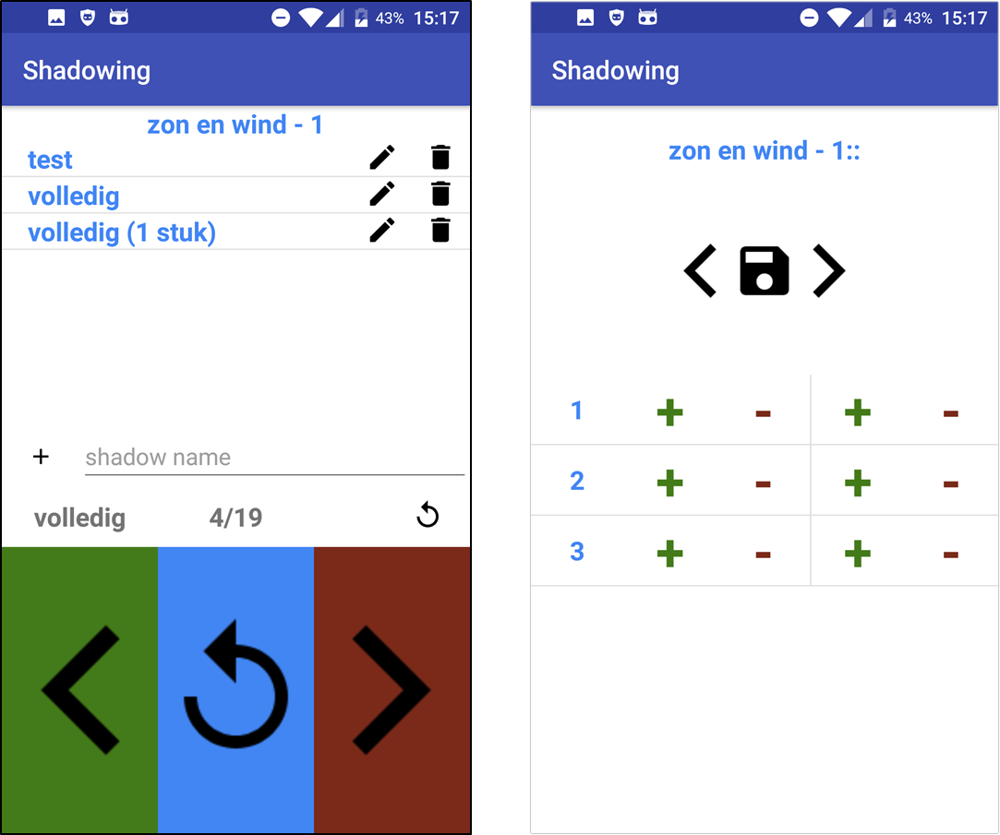

```{r setup, include=FALSE}
knitr::opts_chunk$set(echo = TRUE)
```

When learning 日本語 (Japanese), I became interested in a language learning technique called shadowing. In shadowing, you listen and simultaneously repeat texts spoken by native speakers. This technique trains listening comprehension and allows you to adopt common speak patterns and phrases.

However, at the time I was learning Japanese there was no good app available for shadowing. So I created a simple android app for self use. The app consists of two screen (activities) shown below.

<br>
<center>

</center>
<br>

The screen on the right, allows the user to upload a sound file, split the file in shorter fragments and save the result.

The screen on the left, allows the user to practice shadowing these fragments. The buttons at the bottom cycle through the fragments and the user can repeat each fragment until perfection. Once all fragments are memorized, the user can try shadowing the full text.
