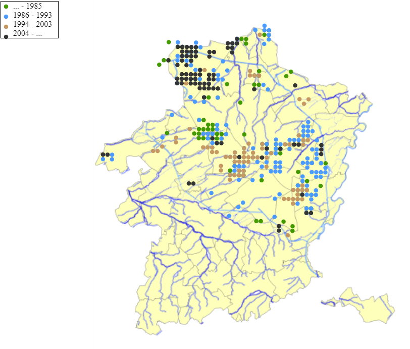

```{r setup, include=FALSE}
knitr::opts_chunk$set(echo = TRUE)
```

Summer 2012 and 2013, I developed, as a student job, two websites for LIKONA (Limburge Koepel voor Natuurstudie).

### Student job 2012: [Atlas biodiversiteit](http://www.biodiversiteitlimburg.be/atlas/)

This website combines a number of local databases with observations of flora and fauna in Limburg. Via a hierarchical selection menu (order, family, species) the user can view the observations from a specific species on the map of Limburg. Registered users of LIKONA, can further refine these results by selecting specific observation periods.

<br>
<center>

</center>
<br>

As part of this project, I created a handy tool in c++ to automatically update the website based on the local access database files.

### Student job 2012: [Dassendatabank](http://www.biodiversiteitlimburg.be/DassenDatabank/)

This website traces the badger population in Limburg. Visitors can report traffic accidents involving badgers and registered users from LIKONA can monitor the location and history of badger castles in the province.

<iframe src="http://www.biodiversiteitlimburg.be/DassenDatabank/" width='800px;' height='450px'></iframe>

This website uses the Google maps API for processing map data. The website has its own mini API through which researchers at LIKONA can automatically access the data from the website in R.

